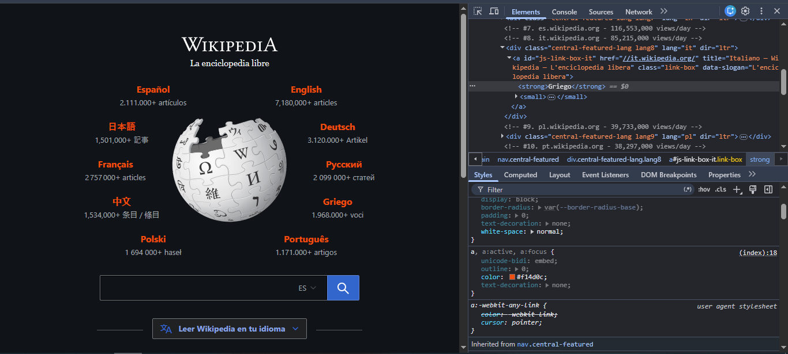
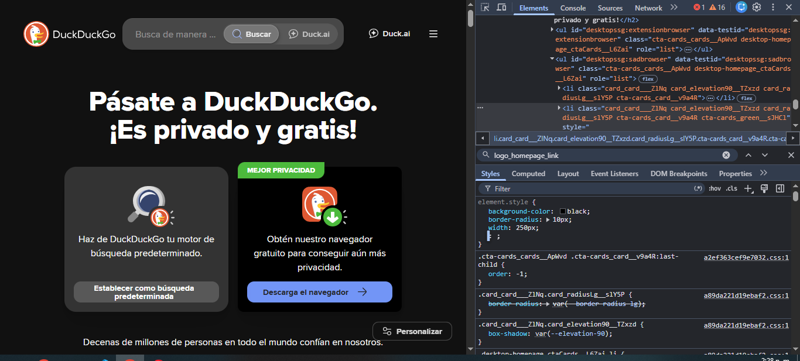

punto 6

c. Cómo están compuestos estos módulos de idioma
Al inspeccionar cualquiera de esos bloques de idioma (las cajas que rodean el logo), verás que su estructura interna en el HTML está compuesta de la siguiente manera:

Etiqueta contenedora (<a>): Todo el módulo es un enlace que te redirige a la versión de Wikipedia en ese idioma.

Texto principal (<strong>): Contiene el nombre del idioma en su propia lengua (ej. Español, English).

Subtexto (<small>): Contiene el número de artículos disponibles en ese idioma y el nombre del idioma traducido al inglés para que sea reconocible a nivel global.

d. Cómo están colocados alrededor del logo
Si haces clic en el contenedor que agrupa a todos los idiomas (un div con la clase .central-featured), verás en la pestaña de Styles cómo los acomodaron en círculo:

Posicionamiento Absoluto (position: absolute): Cada cajita de idioma tiene una clase individual (como .lang1, .lang2). Si las miras en el CSS del inspector, verás que usan propiedades top, bottom, left y right con porcentajes o píxeles para ubicarse con precisión milimétrica en un punto exacto alrededor del logo central.

e. y f. Examinar la versión de Tablet y Móvil
Para ver cómo cambia Wikipedia en pantallas más chicas:

En la esquina superior izquierda del panel del inspector (al lado de la flecha de selección), verás un ícono con forma de celular y tablet combinados (se llama Toggle device toolbar). Hazle clic.

Arriba en la página aparecerá una barra gris donde puedes elegir el dispositivo o cambiar el tamaño de la pantalla arrastrando los bordes.

Versión Tablet (ej. iPad): Los idiomas destacados alrededor del mundo se siguen manteniendo en su posición circular, pero los textos de abajo (proyectos hermanos) se reacomodan para caber en menos columnas.

Versión Móvil (ej. iPhone): El diseño cambia por completo para ser vertical. Los idiomas destacados que rodeaban al logo ya no están en círculo; ahora se listan uno debajo de otro en una sola columna para que se puedan leer bien en una pantalla angosta.

g. Dimensiones de la caja de búsqueda y su separación
Usa la flecha de selección del inspector y haz clic sobre la barra donde se escribe para buscar.

Mirando la pestaña Computed (Calculado) en la parte derecha del inspector (abajo de los estilos), o simplemente poniendo el cursor sobre el código del input, verás sus medidas exactas actuales:

Dimensiones de la caja: La caja mide aproximadamente 440px de ancho (width) por 44px de alto (height) (estos valores pueden variar ligeramente según tu pantalla o zoom, anota los que te marque ahí).

i. Cuánto tiene de separación con el botón de buscar
Si seleccionas el botón de la lupa (el botón de buscar) o la barra de texto, notarás algo curioso: la separación es de 0px. Están completamente pegados, pegando el borde derecho de la barra con el borde izquierdo del botón.

ii. ¿Qué hay de raro con esa separación?
Lo raro (y un excelente truco de maquetación) es que visualmente parece que estuvieran separados por un espacio en blanco.

¿Por qué pasa esto? Al inspeccionar el código, notarás que el botón de la lupa tiene un fondo transparente y no tiene bordes. Lo que le da el diseño de "caja" a la barra de búsqueda es un contenedor padre (
) que engloba a ambos elementos y tiene un borde gris a su alrededor. El botón está metido dentro de la misma caja de texto en lugar de estar afuera, logrando esa ilusión óptica de separación limpia sin usar márgenes.
-------------------------------------------------
punto 7
